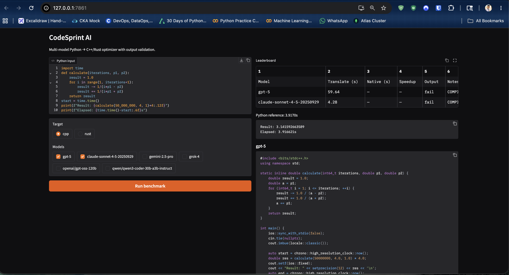

# CodeSprint AI


CodeSprint AI is a multi-model Python performance optimizer. It takes Python code, sends it to multiple LLM providers, translates it into optimized C++17 or Rust 2021, compiles the generated program, runs it, validates stdout, and reports speedups in a Gradio leaderboard.

## Preview

The app provides an interactive benchmark workflow:



## Features

- Multi-provider LLM routing through OpenAI-compatible clients.
- Python to C++17 and Rust 2021 code generation.
- Native compilation and runtime benchmarking.
- Exact stdout validation with numeric tolerance fallback.
- Gradio interface with model selection and leaderboard output.
- Notebook workflow plus exported Python script for easier portfolio review.

## Skills Demonstrated


## Tech Stack

- Python 3.12
- Jupyter Notebook
- Gradio
- OpenAI Python SDK
- OpenAI-compatible APIs for Anthropic, Gemini, Grok, Groq, and OpenRouter
- C++17 compiler via `clang++`
- Rust compiler via `rustc`

## Project Files

- `codesprint.ipynb`: main notebook version of the app.
- `codesprint.py`: Python script exported from the notebook.
- `.env.cloud`: placeholder cloud environment template.
- `.gitignore`: ignores local secrets and virtual environments.

## Setup

Create and activate a virtual environment:

```bash
python3.12 -m venv .venv
source .venv/bin/activate
```

Install dependencies:

```bash
pip install ipykernel python-dotenv openai gradio
```

Add real API keys to `.env`:

```bash
OPENAI_API_KEY=your-openai-key
ANTHROPIC_API_KEY=your-anthropic-key
GOOGLE_API_KEY=your-google-key
GROK_API_KEY=your-grok-key
GROQ_API_KEY=your-groq-key
OPENROUTER_API_KEY=your-openrouter-key
```

Run the Python app:

```bash
python codesprint.py
```

Or open `codesprint.ipynb` in Jupyter or VS Code and run the cells.

## Compiler Notes

C++ mode requires `clang++`.

Rust mode requires `rustc`:

```bash
brew install rust
```

If a compiler is missing, the app reports a readable error such as `COMPILER NOT FOUND: rustc`.

## Portfolio Highlights

This project shows practical AI engineering beyond a simple chat wrapper: provider routing, prompt design, generated code cleanup, compiler orchestration, runtime measurement, and correctness validation all inside one usable interface.
